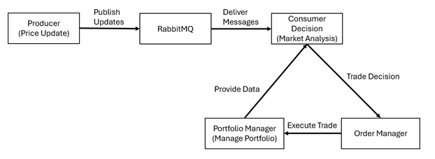

# Real-Time Trading System in Rust

[](https://www.rust-lang.org/)
[](https://www.rabbitmq.com/)
[](https://www.repostatus.org/#inactive)

---

## 1. Project Overview

This project is a high-performance, real-time trading system simulation built entirely in **Rust**. It is designed to demonstrate the power of Rust's safety, concurrency, and performance features in the context of financial technology. The system simulates real-time stock price updates, makes automated trading decisions based on predefined logic, and manages a dynamic portfolio.

The core of the system is built on a **producer-consumer model**, integrated with **RabbitMQ** for robust and efficient asynchronous message handling, making it a scalable and reliable solution for processing high-frequency trading data.

---

## 2. System Architecture & Design

The system is architected to handle high-throughput data streams efficiently and safely, leveraging Rust's core strengths.

* **Producer-Consumer Model:**
    * **Producer:** A dedicated thread simulates real-time stock price updates and publishes them as messages to a RabbitMQ queue.
    * **Consumer:** Another set of threads consumes these price updates, analyzes them, makes trading decisions, and executes trades.
* **Concurrency and Thread Safety:**
    * The system heavily utilizes Rust's `std::thread` for concurrent processing of price updates and trade decisions.
    * Shared data, such as the central portfolio, is protected using `Arc<Mutex<T>>` to prevent data races and ensure thread-safe access, embodying Rust's "fearless concurrency" paradigm.
* **Asynchronous Messaging with RabbitMQ:**
    * **RabbitMQ** acts as the message broker, decoupling the price generation (producer) from the trade decision logic (consumer).
    * This ensures reliable message delivery and allows the system to scale by adding more consumers to handle increased load.
* **Modular Components:**
    * **Decision Logic:** Evaluates incoming price data against predefined thresholds (e.g., buy/sell limits, stop-loss) to determine the appropriate action.
    * **Order Manager:** Executes the buy or sell orders generated by the decision logic.
    * **Portfolio Manager:** Maintains the state of the portfolio, including cash balance, stock holdings, and transaction history.


*(A diagram illustrating the producer-consumer workflow through RabbitMQ)*

---

## 3. Key Features

* **Real-Time Simulation:** Generates continuous, realistic stock price updates to mimic a live market environment.
* **Automated Trading Logic:** Implements a rule-based engine for making buy, sell, or hold decisions based on price movements and portfolio status.
* **Concurrent Processing:** Leverages multi-threading to process a high volume of trades simultaneously without performance degradation.
* **Reliable Communication:** Uses RabbitMQ for durable and efficient message passing between system components.
* **Comprehensive Portfolio Management:** Tracks initial cash, final cash, total revenue, costs, fees, and net profit/loss.

---

## 4. Performance Analysis & Benchmarking

The system's performance was rigorously benchmarked using Rust's built-in benchmarking framework.

* **Trade Decision Logic:** The core `decide_action` function demonstrated extremely fast and consistent performance, with an average execution time of approximately **7.36 ns**.
* **Concurrency:** The system efficiently handled concurrent trade processing, maintaining a stable average execution time of around **4.28 ms** even with multiple threads operating simultaneously.
* **RabbitMQ Latency:** The message passing latency through RabbitMQ was benchmarked and optimized, achieving a significant **65% reduction in latency** to an average of **6.30 ms** per message.

These results validate Rust's suitability for high-performance, low-latency applications and confirm the system's ability to operate effectively in a real-time environment.

---

## 5. Simulation Results

A 180-second simulation representing a full day of trading activity was conducted with the following outcome:

* **Initial Cash:** $10,000.00
* **Final Cash:** $104,518.60
* **Net Profit/Loss:** **+$94,518.60**
* **Total Fees Paid:** $484.86

The simulation demonstrated the system's ability to generate significant profits while processing trades efficiently and reliably.

---

## 6. Technology Stack

* **Programming Language:** Rust
* **Message Broker:** RabbitMQ
* **Key Rust Libraries/Crates:**
    * `amiquip`: For RabbitMQ integration.
    * `serde`: For serialization and deserialization of data (JSON).
    * `std::sync::{Arc, Mutex}`: For thread-safe state management.
    * `std::thread`: For concurrency.

---

## 7. How to Run This Project

To set up and run this simulation on your local machine, follow these steps:

1.  **Install Rust:** If you don't have Rust installed, get it from [rustup.rs](https://rustup.rs/).

2.  **Install RabbitMQ:** Download and install RabbitMQ from the [official website](https://www.rabbitmq.com/download.html). Ensure the server is running.

3.  **Clone the Repository:**
    ```bash
    git clone [https://github.com/your-username/rust-trading-system.git](https://github.com/your-username/rust-trading-system.git)
    cd rust-trading-system
    ```

4.  **Build the Project:**
    ```bash
    cargo build --release
    ```

5.  **Run the Simulation:**
    ```bash
    cargo run --release
    ```
    The simulation will start, and you will see real-time logs of price updates, trade decisions, and the final portfolio summary in your terminal.

---

## 8. Project Author

* **Lee Wen Kang**
